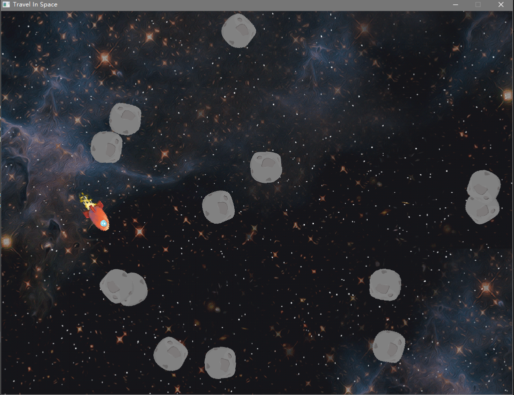
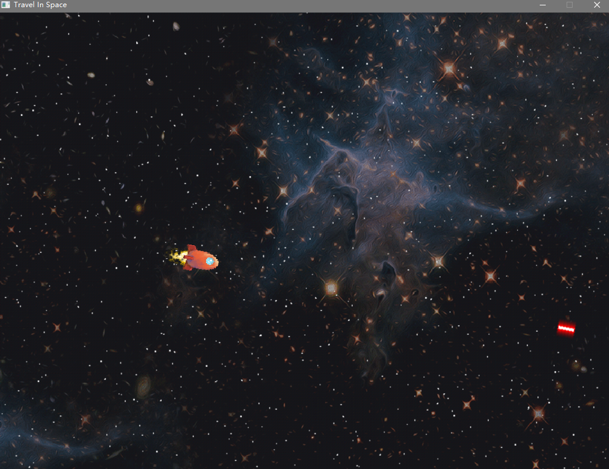

# 向量和基础物理
## 向量在游戏中的运用
向量是游戏中的基本数学，使用Vector表示，而后面的数字表示维度。其中向量的创建以及基本方法都包含在Math.h中，使用时需要include。
```cpp
#include"Math.h"
Vector2 myVector;
myVector.x=5;
myVector.y=10;
```
向量的减法，可以获取到两点之间向量，可用于物体朝向的计算。
```cpp
Vector2 a, b;
Vector2 result=a-b;
```
标量乘法，可以对目标向量缩放和反转。
```cpp
Vector2 a;
Vector2 result=5.0f*a;
```
向量的加法，可用于获取物体前向位移位置。
```cpp
Vector2 a, b;
Vector2 result=a+b;
```
长度配合减法使用，可获取两点之间的距离。平方根计算代价高昂，非必要情况下可用LengthSq()计算长度的平方。
```cpp
Vector2 a;
float length=a.Length();
```
向量的标准化可以将目标向量转换为单位向量，即长度为1的向量。对于表示方向或状态的向量，如前向向量、向上向量等可以考虑标准化处理。由于该计算中向量的长度作为分母，必须保证向量长度不为0或不接近于0，可通过Math::NearZero()判断。
```cpp
Vector2 a;
a.Normalize();
```
```cpp
Vector2 a;
Vector2 result=Vector2::Normalize(a);
```
游戏中将角度转为前向向量，以获取前进方向。但由于游戏中的y轴正方向朝下，所以在计算过程中需反转y。
```cpp
Vector2 Actor::GetForward() const {
    // Negate y-component for SDL
    return Vector2(Math::Cos(mRotation), -Math::Sin(mRotation));
}
```
反正切可计算标准向量的角度。例如，通过减法和标准化获取前向向量，并将-y作为sin，x作为cos，计算反正切得到新角度，更新飞船角度使得它始终朝向小行星。
```cpp
Vector2 shipToAsteroid=asteroid->GetPosition()-ship->GetPosition();

shipToAsteroid.Normalize();
float angle=Math::Atan2(-shipToAsteroid.y, shipToAsteroid.x);

ship->SetRotation(angle);
```
向量的点积通过Dot完成，可通过Acos计算两个向量的夹角。
```cpp
float dotResult=Vector2::Dot(origForward, bewForward);
float angle=Math::Acos(dotResult);
```
向量的叉积使用Cross，可用于力矩和法线的计算，其方向通过右手判断，但游戏中y轴反转，故使用左手。
```cpp
Vector3 c=Vector3::Cross(a, b);
```
## 游戏的基本运动
通过向量实现游戏中的基本物理，而移动作为游戏中最基础的物理，将其封装为组件是有意义的。
```cpp
position+=GetForward()*forwardSpeed*deltaTime;

rotation+=angularSpeed*deltaTime;
```
### 移动组件
移动组件只管理基础移动，如位移和转向，其在Update中实现。而物理的更新通常靠前，在处理完输入就应该对其进行更新，以保证后续图形绘制位置准确可靠。
```cpp
class MoveComponent:public Component{
public:
    MoveComponent(class Actor* owner, int updateOrder=10);
    
    void Update(float deltaTime) override;

    float GetAngularSpeed() const {return mAngularSpeed;}
    float GetForwardSpeed() const {return mForwardSpeed;}
    void SetAngularSpeed(float speed) {mAngularSpeed=speed;}
    void SetForwardSpeed(float speed) {mForwardSpeed=speed;}
    
private:
    float mAngularSpeed;
    float mForwardSpeed;
};
```
不对接近0的数据进行计算，避免0作为分母时产生的错误值。
```cpp
void MoveComponent::Update(float deltaTime){
    if(!Math::NearZero(mAngularSpeed)){
        float rot=mOwner->GetRotation();
        rot+=mAngularSpeed*deltaTime;
        mOwner->SetRotation(rot);
    }
    if(!Math::NearZero(mForwardSpeed)){
        Vector2 pos=mOwner->GetPosition();
        pos+=mOwner->GetForward()*mForwardSpeed*deltaTime;
        mOwner->SetPosition(pos);
    }
}
```
游戏中的小行星作为移动组件的拥有者，在其构造时，加入移动组件并设置相应参数。通过传入this指针，组件的构造可调用AddComponent将自身添加进对象的组件容器中。
```cpp
Asteroid::Asteroid(Game* game)
: Actor(game)
{
    Vector2 randPos=Random::GetVector(Vector2::Zero, Vector2(1024.0f, 768.0f));
    SetPosition(randPos);
    SetRotation(Random::GetFloatRange(0.0f, Math::TwoPi));

    SpriteComponent* sc=new SpriteComponent(this);
    sc->SetTexture(game->GetTexture("Assets/Asteroid.png"));
    
    MoveComponent* mc=new MoveComponent(this);
    mc->SetForwardSpeed(150.0f);
}
```
本游戏创建一定数量的小行星以供玩家消灭。
```cpp
const int numAsteroids=20;
for(int i=0;i<numAsteroids;++i){
    new Asteroid(this);
}
```
### 输入组件
输入组件用于处理玩家输入。在Component基类中添加输入处理的虚函数。以便对象处理输入时，对重写过的组件进行输入处理。
```cpp
virtual void ProcessInput(const uint8_t* keyState){}
```
对于游戏对象，除处理组件的输入外，还可重写针对对象的输入控制，并在角色活跃状态下进行处理。
```cpp
void ProcessInput(const uint8_t* keyState);
virtual void ActorInput(const uint8_t* keyState);
```
```cpp
void Actor::ProcessInput(const uint8_t* keyState){
    if(mState==EActive){
        for(auto comp:mComponents){
            comp->ProcessInput(keyState);
        }
        ActorInput(keyState);
    }
}
```
```cpp
mUpdatintActors=true;
for(auto actor:mActors){
    actor->ProcessInput(keyState);
}
mUpdatingActors=false;
```
该输入组件主要处理基本运动，故而继承移动组件。对可由玩家控制的对象添加输入组件，既能实现输入控制，也能完成基本运动。该组件还支持自定义按键功能。
```cpp
class InputComponent:public MoveComponent{
public:
    InputComponent(class Actor* owner);

    void ProcessInput(const uint8_t* keyState) override;

private:
    float mMaxForwardSpeed;
    float mMaxAngularSpeed;

    int mForwardKey;
    int mBackKey;

    int mClockwiseKey;
    int mCounterClockwiseKey;
};
```
```cpp
void InputComponent::ProcessInput(const uint8_t* keyState){
    float forwardSpeed=0.0f;
    if(keyState[mForwardKey]){
        forwardSpeed+=MaxForwardSpeed;
    }
    if(keyState[mBackKey]){
        forwardSpeed-=MaxForwardSpeed;
    }
    SetForwardSpeed(forwardSpeed);

    float angularSpeed=0.0f;
    if(keyState[mClockwiseKey]){
        angularSpeed+=mMaxAngularSpeed;
    }
    if(keyState[mCounterClockwiseKey]){
        angularSpeed-=mMaxAngularSpeed;
    }
    SetAngularSpeed(angularSpeed);
}
```
### 牛顿物理学
若想实现物体加速度的效果，则可根据F=m*a公式实现。
```cpp
acceleration=sumOfForces/mass;
veclocity+=acceleration*deltaTime;
position+=veclocity*deltaTime;
```
对于物理模拟，可变步长更新会由于更新次数不同导致积分误差，使得快慢机器行为不一。该问题通过固定物理更新时间步长的方式再配合动态渲染来解决。
### 碰撞组件
除了AABB碰撞，还可以用过圆的交集判断是否产生碰撞。通过向量差和长度平方实现，根据长度与半径之和的关系判断两圆是否相交。
```cpp
class CircleComponent:public Component{
public:
    CircleComponent(class Actor* owner);

    void SetRadius(float radius){mRadius=radius;}
    float GetRadius() const;

    const Vector2& GetCenter() const;

private:
    float mRadius;
};
```
```cpp
bool Intersect(const CircleComponent& a, const CircleComponent& b){
    Vector2 diff=a.GetCenter()-b.GetCenter();
    float distSq=diff.LengthSq();

    float radiiSq=a.GetRadius()+b.GetRadius();
    radiiSq*=radiiSq;

    return distSq<=radiiSq;
}
```
对可碰撞的游戏对象添加碰撞组件，设置半径大小。并在UpdateActor中使用全局函数Intersect判断并进行处理。
```cpp
mCircle=new CircleComponent(this);
mCircle->SetRadius(40.0f);
```
```cpp
void Laser::UpdateActor(float deltaTime){
    for(auto ast:GetGame()->GetCircle()){
        if(Intersect(*mCircle, *(ast->GetCircle()))){
            SetState(EDead);
            ast->SetState(EDead);
            break;
        }
    }
}
```
## 其他游戏逻辑
玩家通过按下空格，控制飞船朝前发射激光，根据飞船状态设置激光状态。发射激光后，按键进入冷却，并在UpdateActor中恢复。
```cpp
void Ship::ActorInput(const uint8_t* keyState){
    if(keyState[SDL_SCANCODE_SPACE]&&mLaserCooldown<=0.0f){
        Laser* laser=new Laser(GetGame());
        laser->SetPosition(GetPosition());
        laser->SetRotation(GetRotation());

        mLaserCooldown=0.5f;
    }
}
```
```cpp
void Ship::UpdateActor(float deltaTime){
    mLaserCooldown-=deltaTime;
}
```
## 编译和运行
编写CMakeLists.txt，并在终端编译和调试。
```shell
cmake -G "MinGW Makefiles" -B build
cmake --build build
```
调试完成后，将使用到的dll文件复制到build中，最后运行游戏。
```shell
./build/TravelInSpace
```
游戏运行正常，输入控制正常，图形绘制正常，退出正常。


碰撞正常，冷却正常，清空所有陨石。
