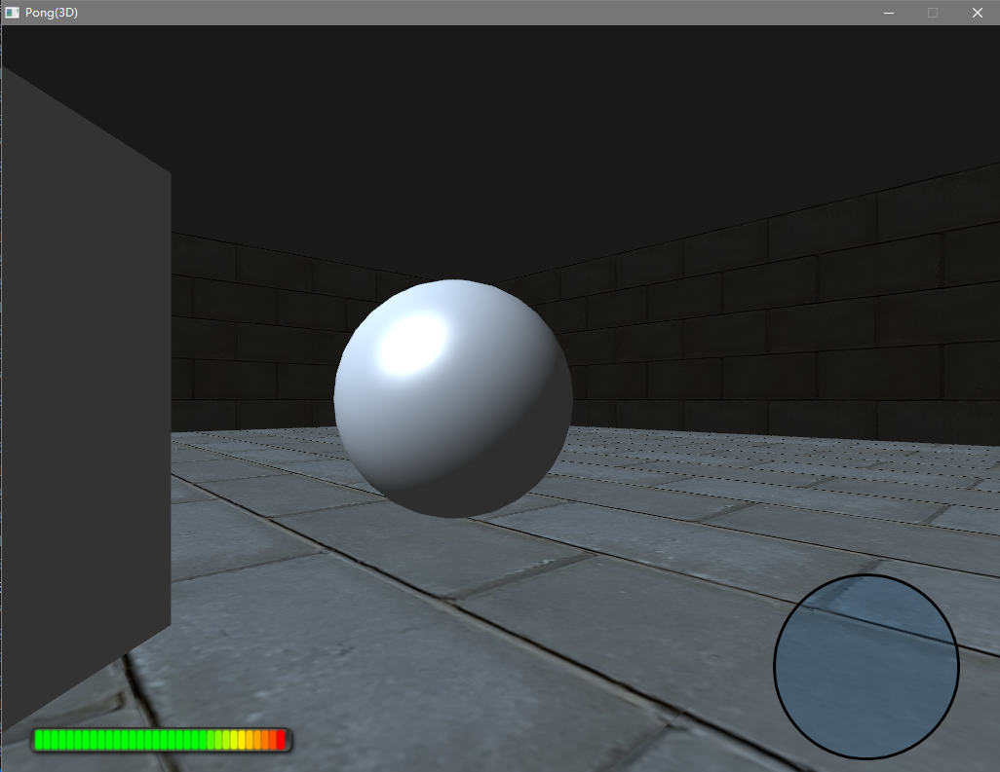

# 3D 图形

## Pong(3D)
本项目是《3D 图形》章节的学习项目，在 OpenGL 3.3 核心模式下构建一个简化的 3D Pong 场景。场景中包含可旋转的 3D 方块、球体与墙面，使用 Phong 光照模型；同时保留 2D 精灵渲染管线，用于绘制血条（HealthBar）和小地图（Radar）等 UI 元素。项目继续沿用 Actor-Component 架构，并引入了基于 JSON 的 `.gpmesh` 网格资源格式、相机 actor 与 view-projection 矩阵。



### ✨️ 特性亮点

- OpenGL 3.3 + GLEW 2.3.1 的 3D 渲染管线
- 自定义 `Shader` 类，支持顶点/片元着色器编译、链接与 uniform（矩阵、向量、标量）设置
- `VertexArray` 类封装 VAO、VBO、IBO，统一使用 `PosNormTex`（位置 + 法线 + UV）顶点布局
- `Texture` 类基于 `stb_image` 加载 PNG/JPG 图像并上传为 OpenGL 2D 纹理
- `Mesh` / `MeshComponent` 加载 `.gpmesh` JSON 网格文件，支持 3D 模型顶点、索引和多纹理索引
- `Phong.vert` / `Phong.frag` 实现方向光、环境光、漫反射与镜面高光
- `SpriteComponent` 使用 OpenGL 四边形绘制 2D UI 精灵，支持世界坐标变换与混合
- `CameraActor` 维护 view 矩阵，配合 perspective 投影矩阵传递给 3D 着色器
- `PlaneActor` 用于快速生成墙面/地面等平面
- 保留 Actor-Component 架构与向量数学库，逻辑层与前几章保持一致
- 独立的 GLSL 着色器文件（`Phong.vert` / `Phong.frag`、`Sprite.vert` / `Sprite.frag`）

### 🌲 项目结构

```tree
3D/
├── Assets/
│   ├── Cube.png
│   ├── Cube.gpmesh
│   ├── Sphere.png
│   ├── Sphere.gpmesh
│   ├── Plane.png
│   ├── Plane.gpmesh
│   ├── HealthBar.png
│   ├── Radar.png
│   └── Default.png
├── Shaders/
│   ├── Phong.vert
│   ├── Phong.frag
│   ├── Sprite.vert
│   └── Sprite.frag
├── CMakeLists.txt
└── Src/
    ├── Main.cpp
    └── Engine/
        ├── Core/
        │   ├── Actor.h/.cpp
        │   ├── CameraActor.h/.cpp
        │   ├── CircleComponent.h/.cpp
        │   ├── Component.h/.cpp
        │   ├── Game.h/.cpp
        │   ├── InputComponent.h/.cpp
        │   ├── MoveComponent.h/.cpp
        │   └── PlaneActor.h/.cpp
        ├── Renderer/
        │   ├── Mesh.h/.cpp
        │   ├── MeshComponent.h/.cpp
        │   ├── Renderer.h/.cpp
        │   ├── Shader.h/.cpp
        │   ├── SpriteComponent.h/.cpp
        │   ├── Texture.h/.cpp
        │   └── VertexArray.h/.cpp
        └── Utils/
            ├── Math.h/.cpp
            ├── Random.h/.cpp
            └── stb_image.h     // 加载纹理
```

### 🛠️ 编译环境

- **操作系统**：Windows
- **编译器**：MinGW-w64 g++ 16.1.0
- **图形/输入库**：SDL2、OpenGL GLEW 2.3.1
- **构建工具**：CMake 4.3.2

```shell
cmake -G "MinGW Makefiles" -B build
cmake --build build
./build/Pong3D
```

> **注意**：运行时需要从项目根目录（`Programming/3D`）启动，以便 `Assets/` 和 `Shaders/` 的相对路径能够正确加载。
