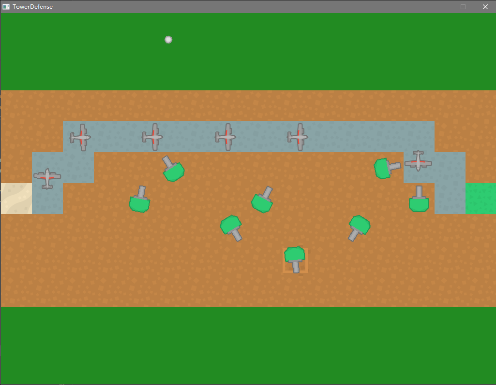

# 人工智能

## 塔防项目

本项目是一个基于 SDL2 与 CMake 构建的 2D 塔防小游戏，用于学习 C++ 游戏编程中的人工智能技术。玩家通过鼠标点击选择地块并按 `B` 键建造防御塔，敌人飞机会自动寻找从起点到终点的路径并向右进攻；每次建塔都会改变地图可通行区域，敌人会实时使用 A* 算法重新规划路线。项目涵盖了状态机、A* 寻路、导航组件等核心 AI 概念。



### ✨️特性亮点

- 基于状态机的 AI 行为控制（AIComponent + AIState）
- A* 寻路算法实现与可视化路径搜索
- NavComponent 导航组件，让敌人沿路径点移动
- Actor-Component 游戏对象架构
- 圆形碰撞组件 CircleComponent
- 塔防核心玩法：敌人移动、炮塔建造、子弹射击、地块交互

### 🌲项目结构

```tree
AI/
├── Assets/
│   └── Textures/
│       ├── Airplane.png
│       ├── Base.png
│       ├── Missile.png
│       ├── Projectile.png
│       ├── TileBrown.png
│       ├── TileBrownSelected.png
│       ├── TileGreen.png
│       ├── TileGreenSelected.png
│       ├── TileGrey.png
│       ├── TileGreySelected.png
│       ├── TileTan.png
│       ├── TileTanSelected.png
│       └── Tower.png
├── CMakeLists.txt
└── Src/
    ├── Engine/
    │   ├── AI/
    │   │   ├── AIComponent.cpp
    │   │   ├── AIComponent.h
    │   │   ├── AIState.cpp
    │   │   ├── AIState.h
    │   │   ├── NavComponent.cpp
    │   │   └── NavComponent.h
    │   ├── Core/
    │   │   ├── Actor.cpp
    │   │   ├── Actor.h
    │   │   ├── CircleComponent.cpp
    │   │   ├── CircleComponent.h
    │   │   ├── Component.cpp
    │   │   ├── Component.h
    │   │   ├── Game.cpp
    │   │   ├── Game.h
    │   │   ├── MoveComponent.cpp
    │   │   └── MoveComponent.h
    │   ├── Renderer/
    │   │   ├── SpriteComponent.cpp
    │   │   └── SpriteComponent.h
    │   └── Utils/
    │       ├── Math.cpp
    │       ├── Math.h
    │       └── Search.cpp
    ├── Game/
    │   ├── Bullet.cpp
    │   ├── Bullet.h
    │   ├── Enemy.cpp
    │   ├── Enemy.h
    │   ├── Grid.cpp
    │   ├── Grid.h
    │   ├── Tile.cpp
    │   ├── Tile.h
    │   ├── Tower.cpp
    │   └── Tower.h
    └── Main.cpp
```

### 🛠️编译环境

- **操作系统**：Windows
- **编译器**：MinGW-w64 g++ 16.1.0
- **图形/输入库**：SDL2、SDL2_image
- **构建工具**：CMake 4.3.2

```shell
cmake -G "MinGW Makefiles" -B build
cmake --build build
./build/TowerDefense
```

## 状态机代码

### 基本实现
状态机表示当前状态，通过特定输入或条件触发状态间转换，即退出当前状态，进入指定状态。
```cpp
enum AIState{
    Patrol,
    Death,
    Attack
};
```
传统状态转换通过switch完成，如果状态多，条件复杂，则switch代码冗长复杂。
```cpp
void AIComponent::Update(float deltaTime){
    switch(mState){
        case Patrol:
            UpdatePatrol(deltaTime);
            break;
        case Death:
            UpdateDeath(deltaTime);
            break;
        case Attack:
            UpdateAttack(deltaTime);
            break;
        default:
            break;
    }
}
```
### 状态类代码
状态机通过一个基类，每个状态通过继承维护特定子类。调用出入函数，实现状态转换。这样的状态转换符合[**状态模式**](../../Patterns/4.%20状态模式/README.md)，逻辑清晰。
```cpp
void AIComponent::ChangeState(AIState newState){
    // Exit current state
    // ...

    mState=newState;

    // Enter current state
    // ...
}
```
```cpp
// 状态机基类
class AIState{
public:
    AIState(class AIComponent* owner)
    :mOwner(owner)
    {}

    virtual void Update(float deltaTime)=0;
    virtual void OnEnter()=0;   // 入口函数
    virtual void OnExit()=0;    // 出口函数
    virtual const char* GetName() const =0;
protected:
    class AIComponent* mOwner;
};
```
```cpp
// 巡逻
class AIPatrol:public AIState{
public:
    AIPatrol(class AIComponent* owner);
    void Update(float deltaTime) override;
    void OnEnter() override;
    void OnExit() override;
    const char* GetName() const override {return "Patrol";}
};
```
```cpp
void AIPatrol::Update(float deltaTime){
    // Do some other updating...

    // 判断死亡条件，转换状态
    bool dead=IsDead();
    if(dead){
        mOwner->ChangeState("Death");
    }
}
```
### 状态组件代码
```cpp
// 通过AIComponent管理AIState
class AIComponent:public Component{
public:
    AIComponent(class Actor* owner);

    void Update(float deltaTime) override;
    void ChangeState(const std::string& name);

    void RegisterState(class AIState* state);

private:
    std::unordered_map<std::string, class AIState*> mStateMap;  // 状态表
    class AIState* mCurrentState;
};
```
```cpp
// 注册状态
void AIComponent::RegisterState(AIState* state){
    mStateMap.emplace(state->GetName(), state);
}
```
```cpp
void AIComponent::Update(float deltaTime){
    if(mCurrentState){
        mCurrentState->Update(deltaTime);   // 通过当前状态的更新函数进行特定更新
    }
}
```
```cpp
void AIComponent::ChangeState(const std::string& name){
    if(mCurrentState){
        mCurrentState->OnExit();    // 退出当前状态
    }

    auto iter=mStateMap.find(name);
    if(iter!=mStateMap.end()){
        mCurrentState=iter->second;
        mCurrentState->OnEnter();   // 进入新状态
    }else{
        SDL_Log("Could not find AIState %s in state map", name.c_str());
        mCurrentState=nullptr;
    }
}
```
### 状态机示例
```cpp
// 创建AI对象
auto a=new Actor(this);
auto aic=new AIComponent(a);
// 注册全部状态
aic->RegisterState(new AIPatrol(aic));
aic->RegisterState(new AIDeath(aic));
aic->RegisterState(new AIAttack(aic));
// 切换状态
aic->ChangeState("Patrol");
```
## 寻路算法代码

### 图形
图形的节点和边作为路径的基础，是寻路算法中的重要数据结构。
```cpp
// 地图节点
struct GraphNode{
    std::vector<GraphNode*> mAdjacent;  // 相邻节点
};
// 地图
struct Graph{
    std::vector<GraphNode*> mNodes;
};
```
```cpp
// 带权重的边
struct WeightedEdge{
    struct WeightGraphNode* mFrom;
    struct WeightGraphNode* mTo;
    float mWeight;
};
// 节点
struct WeightedGraphNode{
    std::vector<WeightEdge*> mEdges;
};
```

### 广度优先搜索
广搜通过队列，不断将附近节点加入队列，直至找到终点或队列为空结束。其缺点是无条件将附近节点加入队列，搜索范围广，搜索时间长。
```cpp
using NodeToParentMap=
    std::unordered_map<const GraphNode*, const GraphNode*>;
```
```cpp
bool BFS(const Graph& graph, const GraphNode* start,
         const GraphNode* goal, NodeToParentMap& outMap)
{
    bool pathFound=false;
    std::queue<const GraphNode*> q;
    q.emplace(start);

    while(!q.empty()){
        const GraphNode* current=q.front();
        q.pop();
        if(current==goal){      // 搜索到后退出
            pathFound=true;
            break;
        }

        for(const GraphNode* node:current->mAdjacent){
            const GraphNode* parent=outMap[node];
            if(parent==nullptr&&node!=start){
                outMap[node]=current;       // outMap记录路径
                q.emplace(node);
            }
        } 
    }
    return pathFound;
}
```
```cpp
// 代码示例
NodeToParentMap map;
bool found=BFS(g, g.mNodes[0], g.mNodes[9], map);
```

### 贪婪最佳优先搜索
贪婪优先搜索通过计算启发量（到终点的距离）并将附近节点加入队列，选取队列中启发量最小的作为下一个节点。搜索时间更短，但搜索出来的路径不一定最短。
```cpp
struct GBFSScratch{
    const WeightEdge* mParentEdge=nullptr;
    float mHeuristic=0.0f;
    bool mInOpenSet=false;
    bool mInCloseSet=false;
};
```
```cpp
using GBFSMap=
    std::unordered_map<const WeightGraphNode*, GBFSScratch>;
```
```cpp
bool GBFS(const WeightedGraph& g, const WeightedGraphNode* start,
          const WeightedGraphNode* goal, GBFSMap& outMap)
{
    std::vector<const WeightedGraphNode*> openSet;    // 存放即将搜索的节点
    const WeightedGraphNode* current=start;
    outMap[current].mInClosedSet=true;      // 标记为已经搜索过的节点，放入闭集

    do{
        for(const WeightedEdge* edge:current->mEdges){
            // 通过outMap获取该点的相关信息
            GBFSScratch& data=outMap[edge->mTo];
            if(!data.mInClosedSet){
                data.mParentEdge=edge;      // 保存路径
                if(!data.mInOpenSet){
                    data.mHeuristic=ComputeHeuristic(edge->mTo, goal);
                    data.mInOpenSet=true;
                    openSet.emplace_back(edge->mTo);
                }
            }
        }

        if(openSet.empty()){
            break;
        }

        // 搜索开集中启发量最小的节点作为下一个当前节点
        auto iter=std::min_element(openSet.begin(), openSet.end(),
            [&outMap](const WeightedGraphNode* a, const WeightedGraphNode* b)
        {
            return outMap[a].mHeuristic<outMap[b].mHeuristic;
        });
        current=*iter;
        openSet.erase(iter);
        outMap[current].mInOpenSet=false;
        outMap[current].mInClosedSet=true;
    }while(current!=goal);

    return current==goal;
}
```

### A*搜索
A*算法对贪婪优先搜索进行改进，计入成本，选取成本（已经走过的距离）与启发量之和最小的作为下一个节点。选出路径最短。
```cpp
for(const WeightedEdge* edge:current->mEdges){
    const WightedGraphNode* neighbor=edge->mTo;
    AStarScratch& data=outMap[neighbor];
    if(!data.mInClosedSet){
        if(!data.mInOpenSet){
            data.mParentEdge=edge;
            data.mHeuristic=ComputeHeuristic(neighbor, goal);
            data.mActualFromStart=outMap[current].mActualFromStart+edge->mWeight;
            data.mInOpenSet=true;
            openSet.emplace_back(neighbor);
        }else{
            // 如果已经在开集当中，重新计算该点的路径成本使它最小
            float newG=outMap[current].mActualFromStart+edge->mWeight;
            // 更新路径和成本
            if(newG<data.mActualFromStart){
                data.mParentEdge=edge;
                data.mActualFromStart=newG;
            }
        }
    }
}
```
### Dijkstra算法
将Astar代码转换成迪杰斯特拉代码，只需删除启发值h，相当于h=0的Astar算法。其次，还需删除目标节点，确保搜索完全部节点。该算法能计算出起点到每个节点的最短路径。
## 跟随路径组件代码
计算出路径后，AI通过跟随路径组件（移动组件子类），沿着既定路线移动。
```cpp
// 转向，传入下一节点位置
void NavComponent::TurnTo(const Vector2& pos){
    Vector2 dir=pos-mOwner->GetPosition();
    float angle=Math::Atan2(-dir.y, dir.x);
    mOwner->SetRotation(angle);
}

void NavComponent::Update(float deltaTime){
    Vector2 diff=mOwner->GetPosition()-mNextPoint;
    // 到达后转向下个节点
    if(diff.LengthSq()<=2.0f*2.0f){     // LengthSq避免平方根的昂贵代价
        mNextPoint=GetNextPoint();
        TurnTo(mNextPoint);
    }

    MoveComponent::Update(deltaTime);
}
```
## 游戏树代码
对于棋类、决策类游戏，游戏树记录局势变化，是AI决策的基础。
### 极大极小算法
AI作为极大玩家，尽可能获得最高的分数。而极小玩家作为AI假象的劲敌，阻止其获得更高的分数。
```cpp
// MaxPlayer, AI
float MaxPlayer(const GTNode* node){
    if(node->mChildren.empty()){
        return GetScore(node->mState);
    }

    float maxValue=-std::numeric_limits<float>::infinity();     // 负无穷
    for(const GTNode* child:node->mChildren){
        // 获得对手对弈后的最高分数，保证我方能走出最有利的一步，尽可能获得更高的分数
        maxValue=std::max(maxValue, MinPlayer(child));
    }
    return maxValue;
}

// MinPlayer, AI假想的劲敌
float MinPlayer(const GTNode* node){
    if(node->mChildren.empty()){
        return GetScore(node->mState);
    }

    float minValue=std::numeric_limits<float>::infinity();
    for(const GTNode* child:node->mChildren){
        // 返回对方下一步的最低分数，辅助其走出最有利的一步
        minValue=std::min(minValue, MaxPlayer(child));
    }
    return minValue;
}
```
```cpp
// 通过极大极小算法获取下一步
const GTNode* MinimaxDecide(const GTNode* root){
    const GTNode* choice=nullptr;
    float maxValue=-std::numeric_limits<float>::infinity();
    for(const GTNode* child:root->mChildren){
        float v=MinPlayer(child);
        if(v>maxValue){
            maxValue=v;
            choice=child;
        }
    }
    return choice;
}
```

### 不完整游戏树
在较复杂的对弈游戏中，游戏树庞大复杂，对性能并不友好。通过一定深度的搜索，获取部分游戏树进行决策则更为合适。
```cpp
float MaxPlayerLimit(const GameState* state, int depth){
    if(depth==0||state->IsTerminal()){
        return state->GetScore();
    }

    float maxValue=-std::numeric_limits<float>::infinity();
    for(const GameState* child:state->GetPossibleMoves()){
        maxValue=std::max(maxValue, MinPlayer(child, depth-1));
    }
    return maxValue;
}
```
### α-β剪枝算法
通过alpha（上限，当前能保证获得的最高分数）和beta（下限，当前能拿到的最低分数）对搜索剪枝，增加搜索速度和深度。
```cpp
// 根据α-β剪枝算法获取下一步
const GameState* AlphaBetaDecide(const GameState* root, int maxDepth){
    const GameState* choice=nullptr;
    float maxValue=-std::numeric_limits<float>::infinity();
    float beta=std::numeric_limits<float>::infinity();
    for(const GameState* child:root->GetPossibleMoves()){
        float v=AlphaBetaMin(child, maxDepth-1, maxValue, beta);
        if(v>maxValue){
            maxValue=v;
            choice=child;
        }
    }
    return choice;
}

// 极大玩家
float AlphaBetaMax(const GameState* node, int depth, float alpha, float beta){
    if(depth==0||node->IsTerminal()){
        return node->GetScore();
    }

    float maxValue=-std::numeric_limits<float>::infinity();
    for(const GameState* child:node->GetPossibleMoves()){
        maxValue=std::max(maxValue, AlphaBetaMin(child, depth-1, alpha, beta));

        // 上层极小玩家已经确保我方能拿到的最低分数为beta，继续遍历maxValue大于等于beta的子树没有意义
        if(maxValue>=beta){
            return maxValue;
        }

        alpha=std::max(maxValue, alpha);    // 不断更新上限
    }
    return maxValue;
}

// 极小玩家
float AlphaBetaMin(const GameState* node, int depth, float alpha, float beta){
    if(depth==0||node->IsTerminal()){
        return node->GetScore();
    }

    float minValue=std::numeric_limits<float>::infinity();
    for(const GameState* child:node->GetPossibleMoves()){
        minValue=std::min(minValue, AlphaBetaMax(child, depth-1, alpha, beta));

        // 上层极大玩家已经确保能拿到最高分数为alpha，继续遍历小于等于alpha的子树没有意义
        if(minValue<=alpha){
            return minValue;
        }

        beta=std::min(minValue, beta);      // 更新下限
    }
    return minValue;
}
```