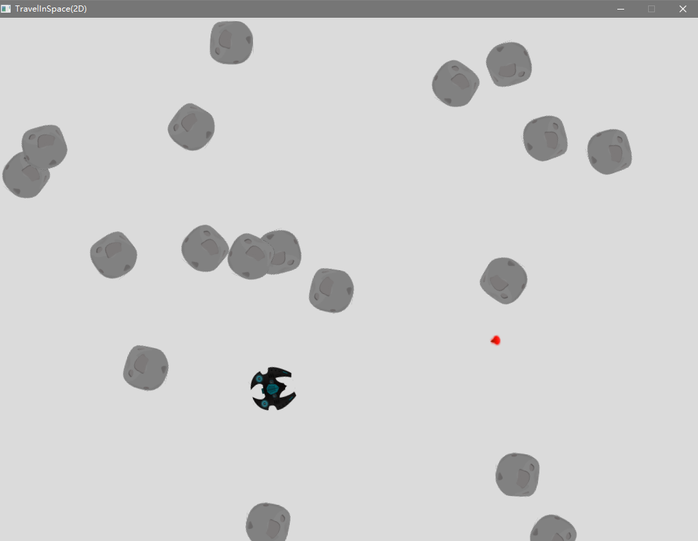

# 图形渲染

## TraveInSpace(OpenGL)
本项目是《向量和基础物理》中太空射击游戏的 OpenGL 版本，用于学习 C++ 游戏编程中的基础图形渲染。玩家通过方向键旋转并推进飞船，按下空格发射激光击毁随机生成的小行星。游戏逻辑保持一致，但渲染后端从 SDL2_image 替换为 OpenGL 3.3，通过着色器、顶点数组对象（VAO）、纹理和矩阵变换完成 2D 精灵绘制。



### ✨️ 特性亮点

- OpenGL 3.x + GLEW 2.3.1 的 2D 渲染管线
- 自定义 Shader 类，支持顶点/片元着色器编译、链接与 uniform 矩阵设置
- VertexArray 类封装 VAO、VBO、IBO 与顶点属性布局（位置 + UV）
- Texture 类基于 stb_image 加载 PNG/JPG 图像并上传为 OpenGL 2D 纹理
- SpriteComponent 使用 OpenGL 四边形绘制精灵，并支持世界坐标变换
- 基于 4×4 矩阵的缩放、旋转、平移变换，由 Actor 维护世界变换矩阵
- 保留 Actor-Component 架构与向量数学库，逻辑层与物理章节一致
- 独立的 GLSL 着色器文件（Basic.vert/Basic.frag、Sprite.vert/Sprite.frag、Transform.vert）

### 🌲 项目结构

```tree
Graphics/
├── Assets/
│   ├── Asteroid.png
│   ├── Laser.png
│   └── Ship.png
├── Shaders/
│   ├── Sprite.frag
│   └── Sprite.vert
├── CMakeLists.txt
└── Src/
    ├── Engine/
    │   ├── Actor.h/.cpp
    │   ├── CircleComponent.h/.cpp
    │   ├── Component.h/.cpp
    │   ├── Game.h/.cpp
    │   ├── InputComponent.h/.cpp
    │   ├── MoveComponent.h/.cpp
    │   ├── Renderer/
    │   │   ├── Shader.h/.cpp
    │   │   ├── SpriteComponent.h/.cpp
    │   │   ├── Texture.h/.cpp
    │   │   └── VertexArray.h/.cpp
    │   └── Utils/
    │       ├── Math.h/.cpp
    │       ├── Random.h/.cpp
    │       └── stb_image.h     // 加载纹理
    ├── Game/
    │   ├── Asteroid.h/.cpp
    │   ├── Laser.h/.cpp
    │   └── Ship.h/.cpp
    └── Main.cpp
```

### 🛠️ 编译环境

- **操作系统**：Windows
- **编译器**：MinGW-w64 g++ 16.1.0
- **图形/输入库**：SDL2、OpenGL GLEW 2.3.1
- **构建工具**：CMake 4.3.2

```shell
cmake -G "MinGW Makefiles" -B build
cmake --build build
./build/TraveInSpaceOpenGL
```