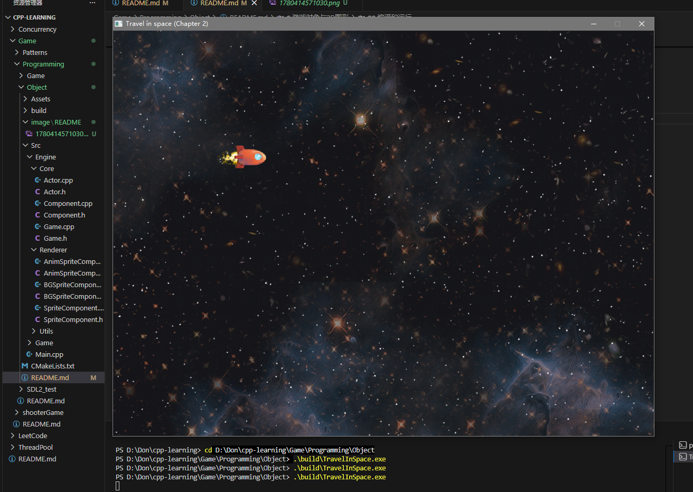

# 游戏对象与2D图形

## 太空遨游

本项目是一个基于 SDL2 与 SDL2_image 的 2D 太空飞船示例（TravelInSpace），用于学习 C++ 游戏编程中的游戏对象设计、组件化架构、纹理加载、精灵动画以及无限滚动背景。玩家通过方向键控制飞船在星空中移动，体验基于 Actor-Component 的游戏对象系统。



### ✨️ 特性亮点

- Actor-Component 游戏对象架构，避免深层继承层次
- 组件自动注册与移除机制，支持更新中延迟添加对象
- SDL2_image 图片加载与 SDL_Texture 纹理管理
- SpriteComponent、AnimSpriteComponent、BGSpriteComponent 分层渲染
- 按绘制顺序排序的 Painter's Algorithm 渲染管理
- 飞船飞行动画与双图拼接的无限滚动星空背景

### 🌲 项目结构

```tree
Object/
├── Assets/
│   └── Textures/
│       ├── Character/
│       ├── Enemy/
│       ├── Farback/
│       ├── Laser.png
│       ├── Ship/
│       └── Stars.png
├── CMakeLists.txt
└── Src/
    ├── Engine/
    │   ├── Core/
    │   │   ├── Actor.cpp
    │   │   ├── Actor.h
    │   │   ├── Component.cpp
    │   │   ├── Component.h
    │   │   ├── Game.cpp
    │   │   └── Game.h
    │   ├── Renderer/
    │   │   ├── AnimSpriteComponent.cpp
    │   │   ├── AnimSpriteComponent.h
    │   │   ├── BGSpriteComponent.cpp
    │   │   ├── BGSpriteComponent.h
    │   │   ├── SpriteComponent.cpp
    │   │   └── SpriteComponent.h
    │   └── Utils/
    │       ├── Math.cpp
    │       └── Math.h
    ├── Game/
    │   ├── Ship.cpp
    │   └── Ship.h
    └── Main.cpp
```

### 🛠️ 编译环境

- **操作系统**：Windows
- **编译器**：MinGW-w64 g++ 16.1.0
- **图形/输入库**：SDL2、SDL2_image
- **构建工具**：CMake 4.3.2

```shell
cmake -G "MinGW Makefiles" -B build
cmake --build build
./build/TravelInSpace
```

## 游戏对象

### 类型

游戏对象有更新并绘制的（如玩家和敌人）、绘制但不更新的（静态对象）、更新但不绘制的（触发器和相机）。

### 模型

首先是传统OOP，通过单一整体式类层次和继承来实现。

```cpp
class Actor{
public:
    // Called every frame to update the Actor
    virtual void update(float deltaTime);
    // Called every frame to draw the Actor
    virtual void Draw(); 
};
```

```cpp
class PacMan:public Actor{
public:
    void Update(float deltaTime) override;
    void Draw() override;
};
```

其次是组件模式，通过多个组件组合在一个类中实现游戏对象，其类层次结构则浅的多。

```cpp
class GameObject{
public:
    void AddComponent(Component* component);
    void RemoveComponent(Component* component);
private:
    std::unordered_set<Component*> components_;
};
```

然后是两种方式相结合，并通过依赖注入（如构造函数中的Game指针）的方式避免单例模式的出现。这种方式在Unreal Engine 4中有用到。

```cpp
class Actor{
public:
    // Used to track state of actor
    enum State{
        EActive,
        EPaused,
        EDead
    };
    // Constructor/destructor
    Actor(class Game* game);
    virtual ~Actor();

    // Update function called from Game (not overridable)
    void Update(float deltaTime);
    // Updates all the components attached to the actor (not overridable)
    void UpdateComponents(float deltaTime);
    // Any actor-specific update code (overridable)
    virtual void UpdateActor(float deltaTime);
    // Getters/setters
    // ...

    // Add/remove components
    void addComponent(class Component* component);
    void RemoveComponent(class Component* component);

private:
    // Actor's state
    State state_;
    // Transform
    Vector2 position_;      // Center position of actor
    float scale_;           // Uniforms scale of actor (1.0f for 100%)
    float rotation;         // Rotation angle (in radians)
    // Components held by this actor
    std::vector<class Component*> components_;
    class Game* game;
};
```

组件类中的构造，传入Actor指针。在构造Actor创建组件的时候，传入this指针。而组件构造的时候调用AddComponent，实现组件自动添加。析构的时候则调用RemoveComponent，实现组件自动移除。

```cpp
class Component{
public:
    // Constructor
    // (the lower the update order, the earlier the component updates)
    Component(class Actor* owner, int updateOrder=100);
    // Destructor
    virtual ~Component();
    // Update this component by delta time
    virtual void Update(float deltaTime);
    int GetUpdateOrder() const { return updateOrder_; }

protected:
    // Owning actor
    class Actor* actor;
    // Update order of component
    int updateOrder_;
};
```

游戏可能正在遍历并更新当前帧的全部对象，而更新过程中可能加入的新对象（如掉落物）。但此时不应该对新对象进行更新，而是加入待处理，等待更新完成之后加入更新队列中。

```cpp
void Game::AddActor(Actor* actor){
    // If updating actors, neet to add to pending
    if(mUpdatingActors){
        mPendingActors.emplace_back(actor);
    }
    else{
        mActors.emplace_back(actor);
    }
}
```

那么游戏更新主要分三个步骤：更新当前所有对象，加入新对象和移除死亡对象。

```cpp
void Game::UpdateGame(){
    // Compute delta time (as in Chapter 1)
    float deltaTime;

    mUpdatingActors=true;
    for(auto actor:mActors){
        actor->Update(deltaTime);
    }
    mUpdatingActors=false;

    // Move any pending actors to mActors
    for(auto pending:mPendingActors){
        mActors.emplace_back(pending);
    }
    mPendingActors.clear();

    // Add any dead actors to a temp vector
    std::vector<Actor*> deadActors;

    for(auto actor:mActors){
        if(actor->GetState==Actor::EDead){
            deadActors.emplace_back(actor);
        }
    }

    // Delete dead actors (which removes them from mActors)
    for(auto actor:deadActors){
        delete actor;
    }
}
```

游戏结束时，在Shutdown中调用Unload将所有资源释放。

```cpp
// Because ~Actor calls RemoveActor, use a different style loop
while(!mActors.empty()){
    delete mActors.back();
}
```

## 图形加载

### 技术栈

下载SDL2_image，将lib、include合并到SDL2中，再将dll文件复制到当前文件夹中。

### 加载文件

头文件中包含SDL2_image.h，并在game的初始化中调用IMG_Init，返回非零表示成功（与SDL_Init不同）。

```cpp
IMG_Init(IMG_INIT_PNG);
```

其次是从文件中加载图片，先由IMG_Load返回SDL_Surface的指针，并用SDL_CreateTextureFromSurface返回SDL_Texture的指针。而texture就可以用于图片的管理和绘制了。

```cpp
// Loads an image from a file
// Returns a pointer to a SDL_Surface if successful, otherwise nullptr
SDL_Surface* IMG_Load(
    const char* file        // Image file name
);
```

```cpp
// Converts an SDL_Surface to an SDL_Eexture
// Returns a pointer to an SDL_Texture if successful, otherwise nullptr
SDL_Texture* SDL_CreateTextureFromSurface(
    SDL_Renderer* renderer,     // Renderer used
    SDL_Surface* surface        // Surface to convert
);
```

```cpp
SDL_Texture* LoadTexture(const char* fileName){
    // Load from file
    SDL_Surface* surface=IMG_Load(fileName);
    if(!surface){
        SDL_Log("Faild to load texture file %s", fileName);
        return nullptr;
    }
    // Create texture from surface
    SDL_Texture* texture=SDL_CreateTextureFromSurface(mRenderer, surface);
    if(!texture){
        SDL_Log("Faild to convert surface to texture for %s", fileName);
        return nullptr;
    }
    return texture;
}
```

### 图形组件

图形组件专门用于图形的管理和绘制。其Draw会在game的GenerateOutput中被调用。而SetTexture会在游戏的每次更新时被调用，设置当前应该绘制的图像。

```cpp
class SpriteComponent:public Component{
public:
    // (Lower draw order corresponds with further back)
    SpriteComponent(class Actor* owner, int drawOrder=100);
    ~SpriteComponent();
    virtual void Draw(SDL_Renderer* renderer);
    virtual void SetTexture(SDL_Texture* texture);

    int GetDrawOrder() const {return mDrawOrder;}
    int GetTextureHeight() const {return mTextureHeight;}
    int GetTextureWidth() const {return mTextureWidth;}

protected:
    // Texture to draw
    SDL_Texture* mTexture;
    // Draw order used for painter's algorithm
    int mDrawOrder;
    // Width/height of texture
    int mTextureHeight;
    int mTextureWidth;
};
```

每一帧进行游戏绘制时，会按照绘制顺序遍历所有图形组件并绘制。所以添加图形组件的时候需按顺序插入。

```cpp
void Game::AddSprite(SpriteComponent* sprite){
    // Find the insertion point in the sorted vector
    // (The first element with a higher draw order then me)
    int myDrawOrder=sprite->GetDrawOrder();
    auto iter=mSprites.begin();
    for(;iter!=mSprites.end();++iter){
        if(myDrawOrder<(*iter)->GetDrawOrder()){
            break;
        }
    }

    mSprites.insert(iter, sprite);
}
```

在设置图片（游戏更新阶段）时，SDL_QueryTexture会获取图片的尺寸，而尺寸会在游戏绘制阶段用到。

```cpp
void SpriteComponent::SetTexture(SDL_Texture* texture){
    mTexture=texture;
    // Get width/height of texture
    SDL_QueryTexture(texture, nullptr, nullptr, &mTextureWidth, &mTextureHeight);
}
```

通过SDL_RenderCopy或SDL_RenderCopyEx（具备旋转和翻转功能）对图形进行绘制。

```cpp
// Renders a texture to the rendering target
// Returns 0 on success, negative value on failure
int SDL_RenderCopy(
    SDL_Renderer* renderer,     // Render target to draw to
    SDL_Texture* texture,       // Texture to draw
    const SDL_Rect* srcrect,    // Part of texture to draw (null if whole)
    const SDL_Rect* dstrect     // Rectangle to draw onto the target
);
```

```cpp
int SDL_RenderCopyEx(
    SDL_Renderer* renderer,
    SDL_Texture* texture,
    const SDL_Rect* srcrect,
    const SDL_Rect* dstrect,
    double angle,                   // Rotation angle (in degrees, clockwise)
    const SDL_Point* center,        // Point to rotate about (nullptr for center)
    SDL_RenderFlip flip             // How to flip texture (usually SDL_FLIP_NONE)
);
```

绘制过程：创建SDL_Rect作为载体，计算尺寸和位置，然后通过SDL_RenderCopy或SDL_RenderCopyEx进行绘制。

```cpp
void SpriteComponent::Draw(SDL_Renderer* renderer){
    if(mTexture){
        SDL_Rect r;
        // Scale the width/height by owner's scale
        r.w=static_cast<int>(mTextureWidth*mOwner->GetScale());
        r.h=static_cast<int>(mTextureHeight*mOwner->GetScale());
        // Center the rectangle around th position of the owner
        r.x=static_cast<int>(mOwner->GetPosition().x-r.w/2);
        r.y=static_cast<int>(mOwner->GetPosition().y-r.h/2);

        // Draw
        SDL_RenderCopyEx(
            renderer,
            mTexture,
            nullptr,        // Source rectangle
            &r,             // Destination rectangle
            -Math::ToDegrees(mOwner->GetRotation()),    // (Convert angle)
            nullptr,        // Point of rotation
            SDL_FLIP_NONE   // Flip behavior
        );
    }
}
```

动画组件则继承图形组件，新增Update用于对动画进行更新，根据mCurrFrame计算当前展示的图片并调用SetTexture设置。还可设置动画图片和动画帧数。

```cpp
class AnimSpriteComponent:public SpriteComponent{
public:
    AnimSpriteComponent(class Actor* owner, int drawOrder=100);
    // Update animation every frame (overriden from component)
    void Update(float deltaTime) override;
    // Set the textures used for animation
    void SetAnimTextures(const std::vector<SDL_Texture*>& textures);
    // Set/get the animation FPS
    float GetAnimFPS() const {return mAnimFPS;}
    void SetAnimFPS(float fps){mAnimFPS=fps;}

private:
    // All textures in the animation
    std::vector<SDL_Texture*> mAnimTextures;
    // Current frame displayed
    float mCurrFrame;
    // Animation frame rate
    float mAnimFPS;
};
```

```cpp
void AnimSpriteComponent::Update(float deltaTime){
    SpriteComponent::Update(deltaTime);

    if(mAnimTextures.size()>0){
        // Update the current frame based on frame rate
        // and delta time
        mCurrFrame+=mAnimFPS*deltaTime;

        // Wrap current fram if needed
        while(mCurrentFrame>=mAnimTextures.size()){
            mCurrFrame-=mAnimTextures.size();
        }

        // Set the current texture
        SetTexture(mAnimTextures[static_cast<int>(mCurrFrame)]);
    }
}
```

背景组件同样需要绘制，继承图形组件。与动画不同，背景图并非整个改变，而是根据角色移动而偏移。一般设置两或多个图片保证背景衔接，不会出现空白。

```cpp
class BGSpriteComponent:public SpriteComponent{
public:
    // Set draw order to default to lower (so it's in the background)
    BGSpriteComponent(class Actor* owner, int drawOrder=10);
    // Update/draw overriden from parent
    void Update(float deltaTime) override;
    void Draw(SDL_Renderer* renderer) override;
    // Set the textures used for the background
    void SetBGTextures(const std::vector<SDL_Texture*>& textures);
    // Get/set screen size and scroll speed
    void SetScreenSize(const Vector2& size){mScreenSize=size;}
    void SetScrollSpeed(float speed){mScrollSpeed=speed;}
    float GetScrollSpeed() const {return mScrollSpeed;}

private:
    // Struct to encapsulate each BG image and its offset
    struct BGTexture{
        SDL_Texture* mTexture;
        Vector2 mOffset;
    };
    std::vector<BGTexture> mBGTextures;
    Vector2 mScreenSize;
    float mScrollSpeed;
};
```

```cpp
void BGSpriteComponent::SetBGTextures(const std::vector<SDL_Texture*>& textures){
    int count=0;
    for(auto tex:textures){
        BGTexture temp;
        temp.mTexture=tex;
        // Each textures is screen width in offset
        temp.mOffset.x=count*mScreenSize.x;
        temp.mOffset.y=0;
        mBGTextures.emplace_back(temp);
        count++;
    }
}
```

```cpp
void BGSpriteComponent::Update(float deltaTime){
    SpriteComponent::Update(deltaTime);

    for(auto& bg:mBGTextures){
        bg.mOffset.x+=mScrollSpeed*deltaTime;

        if(bg.mOffset.x<-mScreenSize.x){
            // 播放完的图片重新衔接到整个数组的后面
            bg.mOffset.x=mBGTextures.size()*mScreenSize.x+bg.mOffset.x;
        }
    }
}
```

## 游戏逻辑

实现操控飞船遨游太空。飞船有移动速度，由ProcessKeyboard控制。飞船有动画组件，播放飞行动画。

```cpp
class Ship:public Actor{
public:
    Ship(class Game* game);
    void UpdateActor(float deltaTime) override;
    void ProcessKeyBoard(const uint8_t* state);
    float GetRightSpeed() const {return mRightSpeed;}
    float GetDownSpeed() const {return mDownSpeed;}

private:
    float mRightSpeed;
    float mDownSpeed;
};
```

动画组件构造时传入this指针，会自动添加到游戏对象的组件中。而Actor构造中传入的game则调用SetTexture从文件中获取图片。最后将动画数组放入动画组件中。

```cpp
AnimSpriteComponent* asc=new AnimSpriteComponent(this);
std::vector<SDL_Texture*> anims={
    game->GetTexture("Asserts/Ship/Ship01.png"),
    game->GetTexture("Asserts/Ship/Ship02.png"),
    game->GetTexture("Asserts/Ship/Ship03.png"),
    game->GetTexture("Asserts/Ship/Ship04.png")
};
asc->SetAnimTextures(anims);
```

Ship实现自己的对象更新，实现边界判定和更新当前位置。

```cpp
void Ship::UpdateActor(float deltaTime){
    Actor::UpdateActor(deltaTime);
    // Update position based on speeds and delta time
    Vector2 pos=GetPosition();
    pos.x+=mRightSpeed*deltaTime;
    pos.y+=mDownSpeed*deltaTime;
    // Restrict position to left half of screen
    // ...
    SetPostion(pos);
}
```
